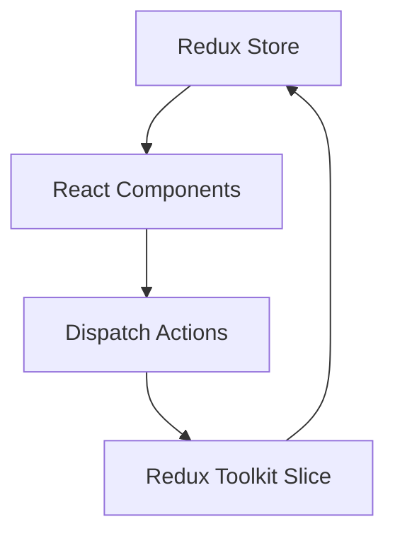

# Redux Toolkit Mastery: Task Manager 🚀

Welcome to the **Redux Toolkit Task Manager**, a premium starter project designed to help you understand and master Redux and Redux Toolkit in a standard React application. 

This repository serves as a perfect blueprint for students, educators, and developers looking to grasp state management concepts with modern aesthetics.

---

## 📸 Overview & Demo

The application is a fully functional, sleek, and modern Task Manager (Todo App) utilizing React, Redux Toolkit, and vanilla CSS with a beautiful dark-mode glassmorphism UI.

### 🎥 Demo Video
> **[Insert Demo Video Here]**
> *(Upload your `.mp4` video to GitHub and replace this block with the video link/gif)*

### 🖼️ Screenshots
> **[Insert Application Screenshot Here]**
> *(Upload an image of the UI on desktop and mobile and put it here)*

---

## 🏗️ Architecture & Concepts

This app follows best practices for separating logic and UI components:



### Core Redux Toolkit Concepts Implemented:
1. **`configureStore`**: Centralized state configuration combining potential multiple slices.
2. **`createSlice`**: Combining reducers and actions into a single feature "slice" (`todoSlice`).
3. **`useSelector`**: Extracting required data from the Redux store state.
4. **`useDispatch`**: Triggering actions (like add, delete, mark as done) to mutate state safely using Immer under the hood.

---

## 📂 Project Structure

```text
src/
├── app/
│   └── store.js             # Redux Store Configuration
├── features/
│   └── todo/
│       └── todoSlice.js     # Redux Toolkit Slice (State, Actions, Reducers)
├── components/
│   ├── AddForm.jsx          # Form to dispatch new tasks
│   ├── AddForm.css          # Form Styles
│   ├── Todo.jsx             # Task list component
│   └── Todo.css             # Task list & Item styles
├── App.jsx                  # Main Application Component (Provider wrapper)
├── index.css                # Global Design System (Variables, dark mode base)
└── main.jsx                 # Entry Point
```

---

## 🚀 Getting Started

To run this project locally, follow these steps:

### Prerequisites
Make sure you have Node.js and npm installed.

### Installation

1. Clone this repository:
```bash
git clone https://github.com/your-username/your-repo-name.git
cd your-repo-name
```

2. Install dependencies:
```bash
npm install
```

3. Run the development server:
```bash
npm run dev
```

4. Open your browser and navigate to `http://localhost:5173`

---

## 💡 Key Learnings & Takeaways
- **No Manual Action Types**: Redux Toolkit `createSlice` auto-generates action creators and action types.
- **Mutable Logic**: Write code completely synchronously and naturally mutate state instead of returning `{...state}`. RTK handles it perfectly via Immer.js.
- **Component Separation**: Form dispatching and List rendering are perfectly decoupled via Redux hooks.

---

## 🤝 Contributing
Contributions are more than welcome! Fork this repository, make a feature branch, and submit a Pull Request.

## 📄 License
This project is open-source and available under the MIT License. Feel free to use it for your learning!
